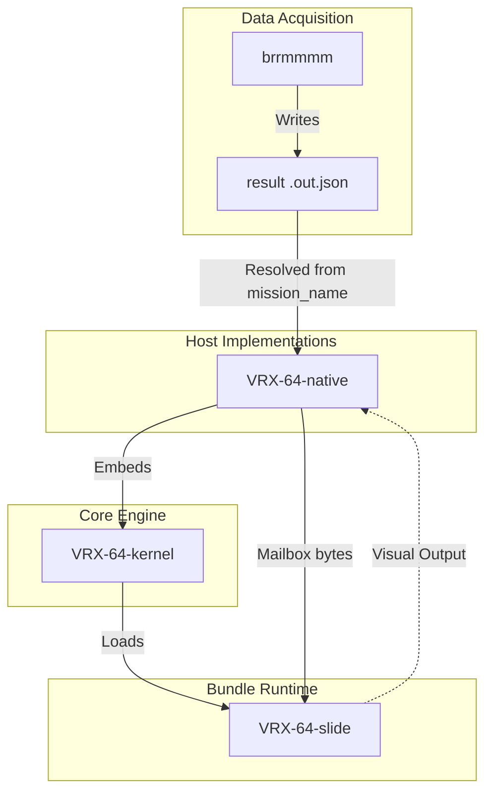

# VRX-64: A High-Performance Framework for Distributed Information Displays

VRX-64 is an experimental architectural framework designed to transform any
WebGPU-capable display into a high-performance, dynamically updating
information dashboard. It differs from a web-browser based dashboard in that
there is no interactivity, and that information is to be presented only, where
that constraint alone forces slide authors to be intentional with the
information displayed.

## Abstract: The Dashboard Operating System Paradigm

The proliferation of digital notifications and the necessity of frequent
check-ins on various information streams can be burdensome. A dedicated,
persistent display or personalized dashboard offers a solution by providing a
single, synchronized location for calendars, reminders, and critical metrics,
facilitating serendipitous information consumption and reducing cognitive load.

Beyond personal use, a prevalent challenge in modern office environments is the
use of web-based interfaces for large-scale, persistent monitoring. Typically,
web pages designed for active user interaction (e.g., complex data dashboards
or monitoring tools) are deployed on large-format wall monitors. In order to
hedge against displaying the wrong information, more data and more graphs tend
to be added to these dashboards until the text is too small to be read
effectively as a dashboard.

VRX-64 asks: if user input and interactivity are removed as an expectation, and
the principles of real-time rendering from the early 2000s are adopted, is it
possible to present more compelling, beautiful dashboards that are actually
utilized, rather than just providing a false sense of security through
visibility?

By targeting hardware such as the **Raspberry Pi 4**
and leveraging the capabilities of **WebGPU**, the framework enables the
necessary infrastructure to ensure that any WebGPU-compatible
browser can serve a dashboard, while still performing better in a native application.

## System Architecture: Native-First Display Runtime

VRX-64 is now scoped to one job: render information quickly and reliably.
Data acquisition is no longer part of the host runtime. Instead, an external
tool such as [`brrmmmm`](../brrmmmm/README.md) writes JSON result files, and
VRX-64 watches those files and forwards their bytes into the slide runtime.

The active contract is:

1. **The Slide (`slide.wasm`)** renders visuals and reads host-provided bytes
   through the existing `channel_poll` mailbox ABI.
2. **The Host (`VRX-64-native`)** loads playlists and bundles, watches the
   configured mission records for updates, and delivers the latest valid payload
   to the slide.
3. **The Fetcher (`brrmmmm` or another external process)** owns networking,
   retries, authentication, and persistence, then writes a durable result file
   that VRX-64 can display.

This keeps acquisition failures and display failures in separate processes while
letting one business-logic producer feed many display implementations.

## Foundational Technologies: WebAssembly and WebGPU

The VRX-64 framework is built upon the pillars of modern web standards:

*   **WebGPU**: Provides the foundational capability for high-performance, low-overhead graphics. By leveraging the modern GPU pipeline, VRX-64 achieves native-grade rendering on modest hardware such as the Raspberry Pi 4.
*   **WebAssembly (Wasm)**: Powers portable slide runtimes so rendering logic stays reusable while the host remains focused on lifecycle, file watching, and GPU execution.

## Repository Structure

The VRX-64 repository is organized into specialized modules that constitute the
complete ecosystem:

*   **`VRX-64-kernel`**: The platform-agnostic core of the display engine. It
    manages slide scheduling, transition state machines, playlist metadata, and
    shader validation.
*   **`VRX-64-native`**: A native host implementation utilizing `wgpu` and
    `winit`, enabling the engine to operate as a standalone desktop
    application that watches mission result files and updates immediately when
    they change.
*   **`VRX-64-slide`**: The specification and toolset for constructing the
    visual components of a `vzglyd` bundle, including audio playback support
    for MP3, WAV, Ogg, and FLAC sound assets.

## Conclusion and Future Directions

The architectural potential of VRX-64 remains largely unexplored. The framework
is intentionally designed to keep display concerns small and fast while letting
other runtimes own acquisition. The objective is a platform for high-performance,
glanceable information displays that can consume durable result files from many
different upstream tools.
