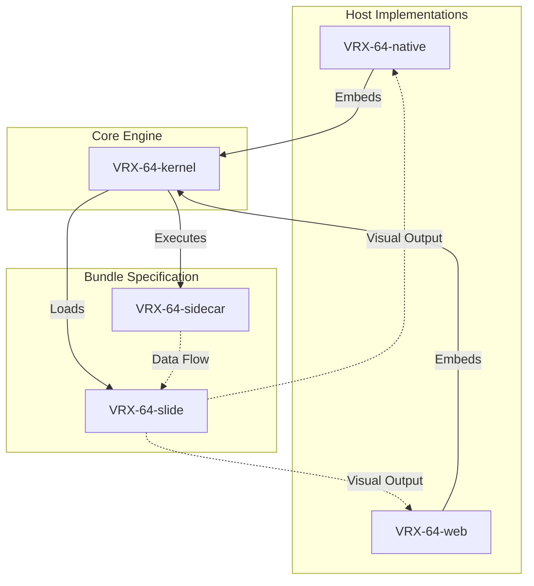

# VRX-64: A High-Performance Framework for Distributed Information Displays

VRX-64 is an experimental architectural framework designed to transform any
WebGPU-capable display into a high-performance, dynamically updating
information dashboard. It differs from a web-browser based dashboard in that
there is no interactivity, and that information is to be presented only, where
that constraint alone forces slide authors to be intentional with the
information displayed.

## Abstract: The Dashboard Operating System Paradigm

The proliferation of digital notifications and the necessity of frequent check-ins on various information streams can be burdensome. A dedicated, persistent display or personalized dashboard offers a solution by providing a single, synchronized location for calendars, reminders, and critical metrics, facilitating serendipitous information consumption and reducing cognitive load.

Beyond personal use, a prevalent challenge in modern office environments is the use of web-based interfaces for large-scale, persistent monitoring. Typically, web pages designed for active user interaction (e.g., complex data dashboards or monitoring tools) are deployed on large-format wall monitors. In order to hedge against displaying the wrong information, more data and more graphs tend to be added to these dashboards until the text is too small to be read effectively as a dashboard.

VRX-64 asks: if user input and interactivity are removed as an expectation, and the principles of real-time rendering from the early 2000s are adopted, is it possible to present more compelling, beautiful dashboards that are actually utilized, rather than just providing a false sense of security through visibility?
By targeting hardware such as the **Raspberry Pi 4**
and leveraging the capabilities of **WebGPU**, the framework enables the
necessary infrastructure to ensure that any WebGPU-compatible
browser can serve a dashboard, while still performing better in a native application.

## System Architecture: The `vzglyd` Bundle Format

The core of the VRX-64 architecture is the `vzglyd` bundle format, which
implements a strict separation of concerns by decoupling visual presentation
from data acquisition and processing.

A `vzglyd` bundle is composed of two discrete, isolated components:

1.  **The Slide (Visual Layer)**: This component is responsible for the
    rendering of graphics, animations, and user interface elements. It utilizes
    WebGPU to leverage hardware-accelerated rendering capabilities, ensuring
    high-performance visual output.
2.  **The Sidecar (Logic and Data Layer)**: This component manages the
    lifecycle of data acquisition. It is responsible for fetching data from
    various sources (e.g., APIs, sensors, databases), performing necessary
    computations, and providing the processed data to the Slide component.

### Decoupling and Polyglot Execution

The architectural isolation between the Slide and the Sidecar facilitates
language agnostim. Because these components are decoupled, they can be
implemented using entirely different programming languages. A Sidecar may be
implemented as a **WebAssembly (Wasm)** module written in Rust, C++, or Python
(via specialized runtimes), while the Slide can utilize JavaScript or Wasm to
interface with the WebGPU API.

This isolation provides significant robustness: a failure in the data-fetching
logic (the Sidecar) does not compromise the stability of the visual
presentation (the Slide). Furthermore, this decoupling allows developers to
select the most efficient tool for each specific computational or rendering
task.

## Foundational Technologies: WebAssembly and WebGPU

The VRX-64 framework is built upon the pillars of modern web standards:

*   **WebGPU**: Provides the foundational capability for high-performance, low-overhead graphics. By leveraging the modern GPU pipeline, VRX-64 achieves near-native rendering performance within the browser environment. This is critical for maintaining high-frame-rate animations and complex visual effects even on resource-constrained hardware like the Raspberry Pi 4.
*   **WebAssembly (Wasm)**: Enables high-performance computation within the browser ecosystem. Wasm allows for the integration of diverse, high-performance languages, providing the computational power required for the Sidecar to perform complex data processing, parsing, and state management, while allowing the Slide to focus on rendering logic.

## Repository Structure

The VRX-64 repository is organized into specialized modules that constitute the
complete ecosystem:

*   **`VRX-64-kernel`**: The platform-agnostic core of the display engine. It
    manages slide scheduling, transition state machines, and shader validation.
    It is designed for embedding within various host implementations.
*   **`VRX-64-native`**: A native host implementation utilizing `wgpu` and
    `winit`, enabling the engine to operate as a standalone desktop
    application.
*   **`VRX-64-web`**: A web-based host implementation that executes the engine
    within a WebGPU-enabled browser.
*   **`VRX-64-slide`**: The specification and toolset for constructing the
    visual components of a `vzglyd` bundle, including audio playback support
    for MP3, WAV, Ogg, and FLAC sound assets.
*   **`VRX-64-sidecar`**: The specification and toolset for developing the
    logic and data-fetching components.

## Conclusion and Future Directions

The architectural potential of VRX-64 remains largely unexplored. The framework
is intentionally designed to be extensible, encouraging researchers and
developers to experiment with new languages, data sources, and rendering
techniques. The ultimate objective is to establish a platform for a new class
of interactive, high-performance, and glanceable information displays.
